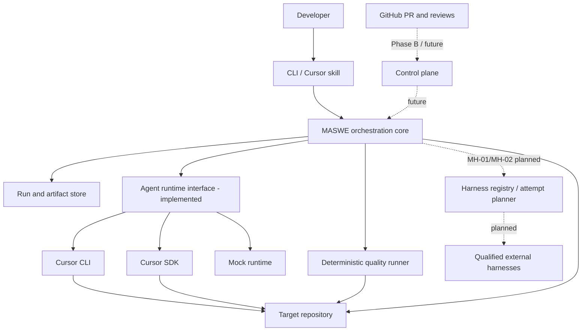
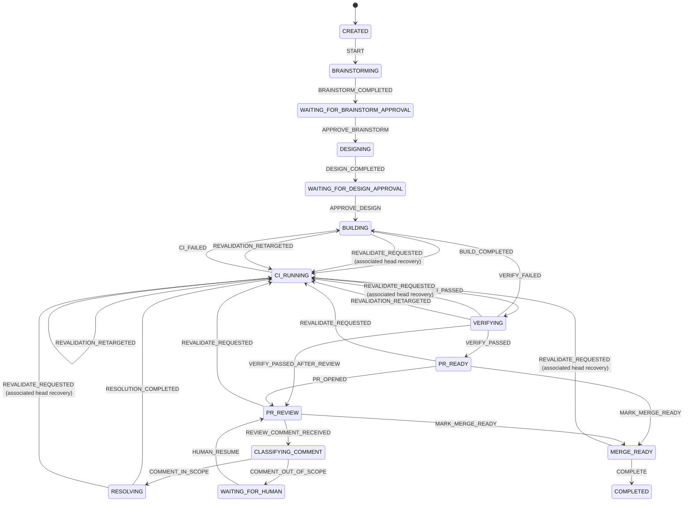
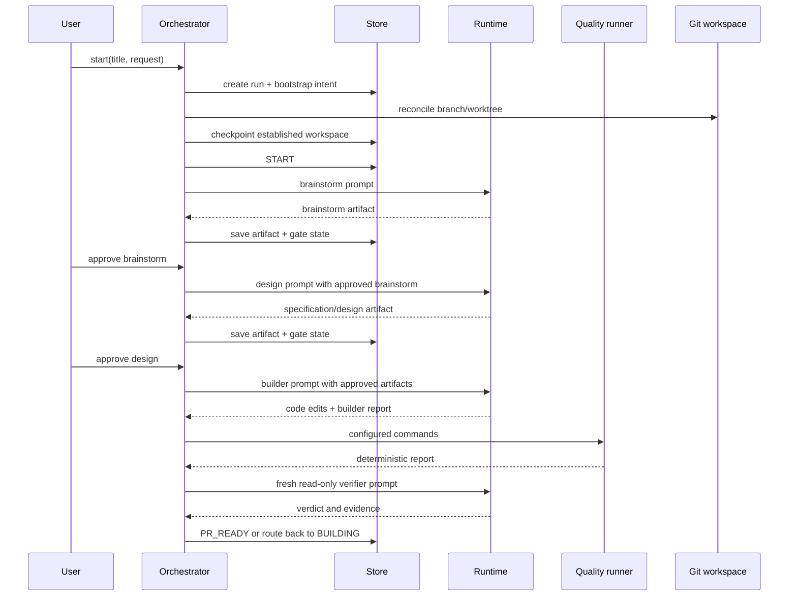

# Architecture

## 1. Decision summary

MASWE is an **orchestrator-first system with a thin Cursor plugin** today and an approved
**capability-negotiated multi-harness execution boundary** for future runtime evolution.

- The orchestration core is authoritative for state, stage order, policy, artifacts, retries, and approvals.
- Cursor CLI and Cursor SDK are the implemented execution adapters.
- MH-00 defines a future harness registry, exact attempt identity, capability negotiation, governed outer supervision, raw/normalized execution evidence, and assurance evaluation without transferring workflow authority to a harness.
- Superpowers defines how each role performs its assigned engineering work.
- Deterministic project commands decide test/build health.
- GitHub Phase A is implemented and keys repository authorization, association, locking, credential
  scope, and check ownership on GitHub's immutable numeric repository ID (#34). Phase B remains
  governed by Issue #3 and must not obtain write authority until #34 is completed, independently
  validated, merged, and post-merge `main` is revalidated.

The accepted MH-00 baseline is `23f06f3900598443dc40c65c35336aecda76ea2f`. The normative planned
multi-harness design is `docs/superpowers/specs/2026-08-26-mh-00-multi-harness-execution-architecture.md`
and ADR-0008. No external harness adapter is implemented by MH-00.

This prevents a single parent model or external harness from becoming an implicit, long-lived workflow engine.

## 2. System context



## 3. Logical components

### 3.1 CLI entry point

`src/cli.ts` is the unconditional shebang entrypoint and safe failure renderer. It delegates to the testable `runCli()` command runner in `src/cli-runner.ts`, which validates the active Node runtime, parses commands, resolves the target repository and configuration, creates a runtime, invokes the orchestrator, and renders run state.

The Node assertion is the first action inside the testable `runCli()` entry function. Unsupported runtimes fail with `MASWE_UNSUPPORTED_NODE_VERSION` before target-path resolution, configuration or run-store access, starter-config writes, worktree/branch creation, provider invocation, or target quality commands. The installed `#!/usr/bin/env node` shebang intentionally selects the user's active PATH runtime; the guard then validates that selected binary.

The governed runtime contract is split across synchronized surfaces:

- `.nvmrc` selects exact Node `24.18.0` as the canonical contributor and primary-CI baseline;
- `package.json` and lockfile root metadata bound support to `>=22.22.2 <23 || >=24.18.0 <25`;
- `.npmrc`, `scripts/verify-node-version.mjs`, guarded npm entry points, and `src/node-version.ts` provide layered rejection;
- exact Node `22.22.2` remains a blocking compatibility floor;
- same-runtime Node child processes use `process.execPath`, while intentional shebang/PATH fixtures and user-configured external commands remain explicit exceptions.

NVM is optional contributor tooling, not a product dependency. Adding another supported major requires an explicit contract change and exact CI qualification rather than a floating environment update.

The CLI contains no transition logic beyond selecting a public orchestrator operation.

Its grammar is strict: it accepts only declared long options, rejects short or abbreviated
options, duplicate options, the option terminator, empty string values, invalid command options,
and extra operands. The global `--config` and `--cwd` options may appear before or after the
command; command-specific options may likewise be interleaved with that command's operands. Both
split (`--title "Title"`) and equals (`--title=Title`) forms are valid. A string value beginning
with `-` must use equals form (for example, `--request=--literal`); split form would treat that
value as another option.

### 3.2 Configuration loader

`src/config.ts` supplies safe defaults, loads project JSON, applies environment overrides, validates essential values, and returns an immutable configuration snapshot for each run.

The configuration snapshot prevents later project edits from silently changing an in-progress run.
Only an omitted project configuration supplies `undefined` and selects the built-in defaults; an
explicit top-level JSON `null` is malformed configuration. Persisted `run.config` is required
historical policy, so both an omitted value and `null` fail closed instead of being replaced with
current defaults. Omitted fields within an otherwise valid configuration retain their documented
migration defaults.

Role permissions are deterministic authority, not a prompt preference. Project configuration and
persisted run snapshots must use this exact matrix:

| Role | Required permission | Allowed per-execution narrowing |
|---|---|---|
| `brainstormer` | `read-only` | None |
| `designer` | `read-only` | None |
| `builder` | `workspace-write` | None |
| `verifier` | `read-only` | None |
| `prResolver` | `workspace-write` | `read-only` only for comment classification |

Any other configured permission or execution override is rejected before runtime invocation.
`quality.commands` is a list of trusted shell strings: `[]` is a valid empty list, while every
present entry must be a non-empty, non-whitespace string. The list is never derived from model or
review input.

MH-03 will later define deterministic global/project/private/invocation harness configuration.
Ordinary preference precedence must remain separate from non-overridable security ceilings/floors;
ambient harness user configuration must not silently become authoritative run policy.

### 3.3 Domain model

`src/domain.ts` contains role, runtime, configuration, state, event, artifact, run, quality, and adapter contracts.

These types are public architecture boundaries. A future API and database should preserve their semantics even when storage representations change.

MH-01 will extend this boundary with harness-neutral capability, attempt, execution-identity,
ambient-input, raw/normalized evidence, and assurance-completeness vocabulary while preserving the
meaning and loadability of current run history.

### 3.4 State machine

`src/state-machine.ts` is the only place that maps workflow events to new states. Generic `FAIL` and `CANCEL` are allowed only for nonterminal states.



Any nonterminal state may transition to `FAILED` or `CANCELLED` through the generic events. Terminal states accept no further events.

`REVALIDATE_REQUESTED` records the first current-head generation and its return gate. Outside
`PR_READY` and `PR_REVIEW`, it is legal only when explicit transition context proves that a
committed GitHub association moved to a different head and stale evidence was invalidated, or that
association movement erased current gate evidence before returning to the workspace target. The
return gate comes from append-only workflow history: a run that entered `PR_REVIEW` returns there;
otherwise recovery returns to `PR_READY`. Recovery never returns directly to `MERGE_READY`.
At either return gate, the orchestrator routes a mismatched committed GitHub association before
checking local workspace freshness, then reloads authoritative state before returning an equality
snapshot. A GitHub-routed checkpoint is returned without starting automatic work until the local
workspace reaches that requested head; local-head routing may continue immediately because its
observed workspace is already aligned. Optimistic races are retried through the bounded target
reconciliation loop, and an unstable target fails closed.
Association routing treats an active `revalidation.requestedHeadSha` as the authoritative target,
then `workspace.headSha` when no generation is active. Prior association and pending-cancellation
heads remain publication and cancellation metadata; they never determine or override the workflow
target. A missing target fails closed, and the revalidation service rejects a predecessor or
observed workspace that conflicts with the authoritative target loaded after target ownership is
acquired. Equal-target delivery is ordinarily event-free; at `PR_READY`, `PR_REVIEW`, or
`MERGE_READY`, missing quality or verification evidence permits exactly one same-target generation
so an interrupted association reversal cannot strand the gate. Its active generation makes later
delivery idempotent.
`REVALIDATION_RETARGETED` preserves all earlier events while moving an active generation back to
`CI_RUNNING`; for a recoverable `FAILED` run it updates the retained resume state to `CI_RUNNING`
without rewriting the historical `FAIL`. A newer authenticated or local head retargets an active
or recoverable failed revalidation generation. Evidence from a superseded generation is unusable.

External harness events do not add a second transition mechanism. Future adapters return typed
attempt results/evidence to the orchestrator; only the state machine/public orchestrator operations
may authorize a workflow event.

### 3.5 Orchestrator

`src/orchestrator.ts` owns workflow behavior:

- Starts and advances runs.
- Builds prompts from approved artifacts.
- Selects roles and model candidates.
- Invokes runtime adapters.
- Enforces model mismatch and fallback policy.
- Writes stage artifacts.
- Runs quality checks.
- Parses verifier and scope-classification contracts.
- Enforces retry ceilings.
- Stops at human and integration gates.
- Publishes terminal workflow state before worktree deletion and retries cleanup independently.

Merge-ready and completion share one exact current-head assertion. It requires no active
revalidation, a known head, the recorded branch in a clean MASWE-managed isolated worktree,
workspace/GitHub head equality for an associated run, and current passing quality and verification
evidence unconditionally. Completion additionally requires current passing merge-ready evidence.
`requireCiPass` and `requireVerifierPass` can make results nonblocking only on the path to
`PR_READY`; they never relax `MARK_MERGE_READY` or `COMPLETE`. The assertion is read-only on
rejection and returns the observed exact head used in event details; historical success events
never substitute for current evidence.

Builder, resolver, quality, verification, merge-ready, and completion publication each perform a
final branch, cleanliness, and exact-HEAD assertion inside the durable per-run publication fence.
Deterministic commits name their exact expected parent and advance the branch only through an
expected-old-SHA compare-and-swap; unexpected Git movement is preserved and fails closed.

Mutable builder and resolver work is prepared in a disposable speculative worktree. Publication
applies only the role delta to the authoritative worktree before the ref compare-and-swap and
prepares the authoritative index only after that ref update succeeds. A definite ref rejection
reverses the role delta before the final safety observation and performs no authoritative mutation
afterward; a timeout, changed ref, failed rollback, or post-ref index failure is outcome-unknown.
Once a MASWE-managed authoritative baseline has been captured, any failure in the mutable-role flow
preserves that managed worktree for retry reconciliation instead of force-removing it. Retry must
re-establish the recorded branch, head, cleanliness, and fingerprint through the normal recovery
checks; a mismatch requires operator reconciliation.

Terminal workflow publication is durable before any worktree deletion. `COMPLETE`, `CANCEL`, and
`FAIL` persist first; physical cleanup never authorizes or rewrites that workflow state.
`terminalCleanup` is separate operational lifecycle metadata on the run record, not a workflow
event or evidence field. `pending` and `failed` cleanup are retryable through `maswe cleanup`.
`preserved` retains governed Issue #28 recovery state (`bootstrap-recovery`,
`revalidation-recovery`, or `publication-outcome-unknown`) and rejects cleanup until that recovery
is consumed or the run is superseded. Cleanup retries append no workflow events and change no
workflow evidence, GitHub association evidence, artifacts, approvals, counters, or engineering
failure classification. Production cleanup retains the `maswe/<run-id>` branch. Every destructive
attempt re-proves ownership from the exact repository, recorded or bootstrap-derived path, Git
worktree registration, branch, HEAD, and type before deletion. A CREATED bootstrap failure may
leave a deterministic managed worktree before `run.workspace` is checkpointed; cleanup derives that
target from durable `workspaceBootstrap.plannedWorktreePath` when present, otherwise from a
uniquely proven `maswe/<run-id>` registration matching the bootstrap source HEAD, and must not
publish `complete` while the exact path or registration may still survive or while historical
target identity cannot be established without consulting the current process temp directory.
Governed `retryFromFailed()` for isolated `resumeState === "CREATED"` records that omit
`plannedWorktreePath` must bind that same uniquely proven registration into durable bootstrap
authority before retry workspace reconciliation; ambiguity fails closed. A
legacy terminal record that
omits `terminalCleanup` is unknown until reconciled; ambiguous legacy `FAILED` preservation fails
closed.

It does not contain Cursor SDK implementation details, shell output parsing, or persistence internals.

The policy boundary is also owned here. The orchestrator applies the authoritative read-only
workspace fence around runtime adapters: it captures the workspace fingerprint and, in Git
repositories, exact `HEAD` before every read-only invocation. It checks both again in a `finally`
path after either a runtime return or a runtime throw. The final classification is HEAD-first: a
changed or unreadable post-run `HEAD` is `policy-read-only-head-moved` even if the fingerprint also
changed; only a stable/readable `HEAD` followed by a changed fingerprint is
`policy-read-only-workspace-mutation`. Cursor adapters retain local fingerprint checks as defense
in depth, but the orchestrator's fence is the authoritative classification. Runtime-reported
actual-model identity is compared with the requested model by the orchestrator; a mismatch is a
policy failure, not an ordinary model attempt failure. Policy failures are re-thrown directly and
never enter runtime fallback or all-attempt aggregation.

### 3.6 Run and artifact store

`src/store.ts` persists each run below:

```text
.maswe/runs/<run-id>/
├── run.json
├── .mutation-journal-v1/.lock-journal-v3/
└── artifacts/
    ├── 02-brainstorm.md
    ├── 03-specification-and-design.md
    ├── 04-builder-report.md
    ├── 05-quality-report.md
    ├── 06-verification-report.md
    ├── 07-review-comment.md
    ├── 08-comment-classification.md
    └── 09-resolution-report.md
```

`run.json` is an event-bearing snapshot, not an event-sourced database. It stores enough history
for audit and recovery in a single-host local deployment. Mutating operations use the permanent
per-run `.lock-journal-v3/` ticket journal described below. `writeArtifact` still rejects stale
caller versions and only mutates authoritative on-disk state, so the lock change does not weaken
optimistic versions or atomic run/artifact publication.

Target retargeting and final stage publication use a second durable per-run journal beneath
`.mutation-journal-v1/`. Target claims serialize every revalidation route and GitHub association
head mutation with the final authoritative reload, builder/resolver commit, evidence/event
publication, and successful verifier context clear. A publication performs one final successor
scan after its reload: an already-published queued target claim wins; a target claim published
after that scan observes the completed publication. The journal is separate from the store journal
so protected callbacks can take ordinary run data locks without recursive acquisition.

Artifacts are SHA-256 hashed when written. A reference names exactly one direct child of
`.maswe/runs/<run-id>/artifacts/`: no absolute paths, traversal, nested paths, or non-portable
filenames are valid. Its physical leaf is ASCII `[A-Za-z0-9._-]+`, is neither `.` nor `..`, does
not end in `.`, and cannot have a Windows reserved device stem (including an extension or the
`¹`/`²`/`³` device-number variants). When a generated writer leaf would be reserved, the writer
uses an injective hexadecimal escape namespace; uppercase and escape-prefix-shaped generated
leaves use the same encoding so distinct logical names remain distinct on case-insensitive
filesystems. Lowercase portable leaves keep their historical form, and existing schema-version-1
references remain readable. Publication rejects a physical path owned by another logical artifact
or an unexpected existing target instead of overwriting it. Reads verify every namespace ancestor
is an ordinary directory, open only an ordinary final file with no-follow support, bound the read to 1 MiB,
recheck the namespace, and compare the content digest with the recorded SHA-256. This prevents
accidental pathname escape and fails closed when no-follow support is unavailable. A future store
can place content in object storage and keep the same reference contract.

Future multi-harness attempt/raw-evidence persistence is a separate planned contract. MH-01 must
preserve current run/artifact semantics while representing exact harness/transport/profile/model,
ambient-state, retry/auxiliary-call, isolation, child-lineage, raw-evidence, normalized-evidence,
and completeness facts without treating them as workflow-authorizing artifacts.

### 3.7 Prompt builder

`src/prompt-builder.ts` loads versioned templates from `prompts/`, injects the request and previously approved artifacts, and creates a self-contained stage prompt.

Prompts are implementation assets, not the workflow source of truth. A prompt cannot authorize a transition or bypass policy.

Template rendering is a single pass over declared uppercase placeholders. Values are inserted
literally and are never rescanned, so placeholder-shaped request or artifact text remains data.
An unknown placeholder fails deterministically before runtime invocation.

### 3.8 Runtime adapter interface

`AgentRuntime` defines three operations:

```ts
execute(request): Promise<RuntimeResult>
doctor(): Promise<RuntimeDoctorResult>
listModels(): Promise<string[]>
```

Implemented adapters:

- `MockRuntime`: deterministic outputs for tests and workflow development.
- `CursorCliRuntime`: invokes the Cursor `agent` command in print mode. **New runs** resolve logical model names via `resolveProjectModels` against a fail-closed structured catalogue parse; **existing-run stages** resolve a case-insensitive exact selector to the trusted catalogue entry's canonical spelling before execution and never substitute family, provider, or effort variants. That canonical entry drives the runtime request and the orchestrator's trusted identity comparison. Unwraps JSON/`stream-json` stdout by decoding the transport envelope once and reading only the authoritative string `result` field (text mode keeps raw stdout); never treats stderr as successful assistant content; structured modes never fall back to raw envelope text. Terminal markers are validated only on that decoded logical text. `requestedModel` records the exact candidate MASWE selected. Cursor CLI output does not provide an authoritative mapping from its optional stream initialization model label to that exact candidate, so this adapter omits `actualModel` in every output mode instead of synthesizing identity evidence; the orchestrator treats absence as identity unavailable, while any malformed present identity or exact mismatch is a policy failure. Non-zero process stderr stays inside the adapter: the returned error contains a structured failure code, safe execution metadata, and a redacted bounded diagnostic; metadata stores `stderrPresent`, never raw stderr. Adds `--mode ask` for read-only roles and `--force` only for write roles; adds `--trust` when `policy.trustManagedWorktrees` is set for MASWE-managed worktrees. Doctor emits typed check codes, isolates catalogue discovery from per-role resolution, and, for normal Cursor CLI commands, skips downstream checks with explicit prerequisites when catalogue or model checks fail. The documented Node transport-only stand-in is an explicit test seam: its `node -e` stdin probe needs no model, so catalogue/model failures do not block it. Every eligible stdin probe uses `policy.doctorProbeTimeoutMs` and cleans its probe branch/worktree by recorded probe identity in `finally`.
- `CursorSdkRuntime`: dynamically imports `@cursor/sdk` and runs a local one-shot `Agent.prompt` call (no catalogue capability; empty-catalogue pass-through stays SDK-only). Both `execute()` and `doctor()` use an injectable import seam defaulting to dynamic import.

The optional SDK import means the CLI can build and run without installing the beta SDK.

`RuntimeResult` is discriminated by `status`. Finished results carry assistant output. Error results
also require a `RuntimeFailureDiagnostic` with a stable code, safe message, requested/configured
model where known, stderr-presence flag, truncation flag, and applicable exit/timeout/duration/
transport fields. The core never parses human-readable error prose to make policy decisions.

When fallback candidates fail, the core converts each typed diagnostic into an explicit durable
subset. `RunRecord.failure.runtime` is optional for schema-version-1 compatibility and contains at
most eight attempts plus total/omitted counts and an aggregate-truncation flag. Each attempt keeps
the attempted model display, code, a 512-code-point safe message, requested/configured model
displays where supplied, exit/timeout/duration/transport fields where supplied, `stderrPresent`,
and `truncated`. Model displays are single-line, delimiter-neutral, and capped at 256 code points;
the actual configured model passed to the runtime is not rewritten.

The following policy failures have durable codes and do not become fallback attempts:

| Code | Meaning |
|---|---|
| `policy-role-permission-mismatch` | A persisted/configured role permission or execution override violates the fixed matrix. |
| `policy-read-only-workspace-mutation` | A read-only invocation changed the protected workspace fingerprint. |
| `policy-read-only-head-moved` | A read-only invocation changed or made unreadable the exact Git `HEAD`. |
| `policy-runtime-identity-mismatch` | The runtime reported an actual model different from the requested model. |

Successful runtime-backed transition events cross the same untrusted runtime-to-persistence
boundary. `runtimeEventIdentityDetails()` creates display-only copies of `requestedModel` and
`actualModel` with the model-display policy, and optional `agentId` and `runtimeRunId` with a
separately named bounded identifier policy. Runtime invocation and exact-model enforcement consume
the original values before those copies are constructed.

### 3.8A Planned multi-harness execution boundary (MH-00)

The current `AgentRuntime` interface remains the implemented compatibility boundary until MH-01 and
MH-02. External harness adapters must not be added by extending Cursor-specific assumptions through
the orchestrator.

The planned execution path is:

```text
orchestrator
  -> attempt planner (role + exact workspace/head + policy + assurance)
  -> harness registry / exact qualification
  -> governed attempt supervisor
  -> harness adapter + adapter-specific transport
  -> raw execution evidence
  -> normalized evidence + completeness
  -> assurance/policy verdict
  -> orchestrator
```

The attempt identity separates harness, adapter/executable, transport/protocol,
profile/composition, requested provider/model/effort, runtime-reported identity, identity-evidence
strength, permissions, sandbox/outer isolation, ambient/hidden state, retries/auxiliary calls,
child lineage, and raw/normalized evidence completeness.

Routing is deterministic and capability-negotiated. Unknown or unproven required capabilities fail
closed. Harness names never imply permissions, model/provider, transport, profile, memory,
delegation, internal retries, workflow support, or publication authority.

MASWE owns the exact workspace/worktree and outer process supervision. Initial external harnesses
are read-only; inner harness sandboxes are additional evidence/enforcement, not replacements for
MASWE's HEAD/fingerprint fence. External approvals, jobs, workflows, task boards, retries, and
subagents are execution evidence or requests, not workflow authority. MASWE remains the only Git
commit/publication authority until a separately approved MH-07 writer contract.

Direct and transitive product identity remain distinct: `MASWE -> Codex` is not equivalent to
`MASWE -> DeepSeek Harness -> Codex`. Hermes validates transport/provider/model/memory/delegation
separation; DeepSeek Harness additionally validates exact Cordis profile/composition, internal
retry/workflow/plugin/sandbox, hidden-state, and evidence-completeness separation.

The complete planned contract and delivery ordering are defined by the MH-00 design spec and
ADR-0008. Multi-harness runtime implementation remains blocked until #3 Phase B, MH-01, and MH-02
entry gates are satisfied.

### 3.9 Read-only enforcement

`src/git-snapshot.ts` computes a SHA-256 workspace fingerprint for both Git and non-Git working directories:

- **Git mode:** porcelain status including untracked files; unstaged binary diff; staged binary diff; paths and contents of untracked files. Git-plane probes always pathspec-exclude `.maswe/` (they do not rely on `.git/info/exclude`). Other paths still honor ordinary `--exclude-standard` policy.
- **Non-Git mode:** a stable namespace sentinel (not the invariant identity string) so the digest remains deterministic when nothing authoritative changes.
- **Both modes:** authoritative `.maswe` state under the fingerprinted `cwd`, hashed only through the MASWE-plane hasher: project config, `runs/*/run.json`, and durable artifact files.

Intentionally excluded from the MASWE portion (expected orchestration churn): `.lock`,
`.admin.lock`, `.admin.lock.recovering`, canonical protocol entries beneath exact
`runs/<run-id>/.lock-journal-v3/` and
`runs/<run-id>/.mutation-journal-v1/.lock-journal-v3/` paths, and ordinary `*.tmp` staging files. Unexpected or
malformed journal entries remain fingerprint-visible and also fail journal validation. The
journal exclusion is deliberately path-specific; a `.lock-journal-v3` name elsewhere under
`.maswe` remains fingerprinted. Isolated worktrees fingerprint their own `cwd` (typically without
a local `.maswe` store); non-isolated checkouts include the operator-tree `.maswe` so read-only
roles cannot mutate handoffs undetected. Workspace identity fields (`baseSha` / `headSha` /
`branch`) may still record `not-a-git-repository` for non-Git trees; that sentinel is separate
from the fingerprint digest.

The orchestrator performs the authoritative final comparison before and after every read-only
runtime call and performs the Git `HEAD` check when applicable. Its `finally` fence runs after
both a normal runtime return and a thrown runtime error. It checks post-run `HEAD` first: a changed
or unreadable head is `policy-read-only-head-moved`, even if a later fingerprint check would also
detect a change. With a stable/readable head, a changed fingerprint is
`policy-read-only-workspace-mutation`. Cursor CLI and SDK adapters also retain local fingerprint
checks as defense in depth, but do not replace the orchestrator's final classification. Neither
policy failure is eligible for fallback aggregation. This is a mutation detector, not an
operating-system sandbox. A future sandbox can prevent writes rather than merely detecting them.

Bootstrap source-drift checks exclude the orchestrator-owned `.maswe` namespace; read-only role
fingerprints continue to include authoritative `.maswe` state. The distinction prevents MASWE's
own intent/checkpoint writes from looking like source drift without hiding durable handoff
mutation from a read-only role.

### 3.10 Quality runner

`src/quality.ts` runs trusted project commands sequentially with the system shell. It records exit code, stdout, stderr, and duration. It stops after the first failure. Timeouts use `src/process.ts`, which terminates the shell process tree (POSIX process group / Windows `taskkill /T`) and bounds Promise settlement even if a descendant held pipes open.

Quality commands never come from model output, issue text, or PR comments.

`policy.allowedPathGlobs` is portable and deterministic. MASWE normalizes configured glob strings
from `\\` to `/`, but preserves each Git-reported candidate path as the authoritative scope
subject, and anchors each match to the whole path. A literal POSIX `\\` therefore remains a
filename character rather than becoming a directory separator. `*` matches zero or more
non-separator characters; `?` exactly one non-separator; `**` zero or more characters,
including separators; and `**/` zero or more complete path segments, including zero segments.
`**` and `**/*` each permit every candidate path. Production working-tree candidates are
non-empty file paths, but the matcher special-cases both forms without a non-empty restriction.
Dotfiles are ordinary path characters, and regex metacharacters in a glob are literal rather than
a second pattern language. A changed path is allowed when at least one configured glob matches.

GitHub check publication uses a hash-addressed per-PR journal, separate from the short global
association transaction. Old-head cancellation intent is also persisted on the run as a bounded
SHA set and is cleared only after cancellation plus current-head publication completes. This keeps
one rate-limited PR from holding the global association journal and makes partial publication
retries deterministic.

GitHub association publication is event-free and rollback-capable; workflow request and retarget
events publish only after association commit and are never rolled back. This ordering keeps a
failed association transaction from leaking a workflow event while treating a committed workflow
event as immutable history.

## 4. Stage data flow



Every production-created run, including a superseding replacement, persists workspace bootstrap
intent before branch or worktree side effects and durably checkpoints the established workspace
before `START`. A process restart reconciles a partial `CREATED` run from those durable facts; it
does not infer completed bootstrap from an existing branch or worktree alone.

A future harness-neutral stage execution preserves the same workflow sequence: the runtime box is
replaced by an exact MASWE attempt plan plus qualified harness execution and evidence evaluation;
the harness does not own the surrounding state transitions.

## 5. Model routing

Each role has:

- Primary model slug.
- Optional ordered fallback slugs.
- Reasoning effort metadata.
- Permission mode.

With `rejectModelFallback: true`, only the primary candidate is attempted. If a runtime reports an actual model different from the requested model, the run fails.

With `rejectModelFallback: false`, runtime or startup failure may advance through configured candidates. Every attempt remains visible in the failure message and successful event metadata.

Model aliases are project configuration for **new runs only**. For runtimes that implement catalogue discovery (`CursorCliRuntime` via `agent models`):

- **`start`:** discovers the catalogue, resolves logical role models to exact executable IDs (effort-aware: an explicit `-high`/`-medium`/`-low` suffix requires the same effort; otherwise fail closed), and **persists** those exact IDs in the new `run.config` snapshot.
- **`doctor`:** for normal Cursor CLI commands, discovers the catalogue and resolves an exact ID for its stdin probe only. The Node transport-only test stand-in instead uses `node -e`, requires no model, and remains eligible when Node's unsupported catalogue command fails. Doctor does **not** create a run and does **not** persist a `run.config` snapshot. Probe timeout comes from `policy.doctorProbeTimeoutMs` (default `60_000`, hard bounds `1_000..300_000`, no clamping).
- **Existing-run stages:** treat the persisted spelling as a selector, resolve a case-insensitive exact
  match to the live catalogue entry's canonical spelling before execution, and never substitute
  same-core, same-family, provider, or effort variants when the catalogue drifts. The canonical
  entry drives both the runtime request and the orchestrator's trusted comparison identity;
  runtime-reported metadata cannot replace it.

`CursorSdkRuntime` has no catalogue capability; doctor/start do not call `agent models`, and empty-catalogue pass-through keeps configured IDs as-is for SDK-only paths.

MH-01 generalizes routing without weakening these exact-selector rules: provider, requested model,
runtime-resolved/reported identity, effort, harness, transport/protocol, and profile/composition are
separate attempt facts. Fallback remains MASWE-authorized and produces a new attempt; hidden
harness-local model/provider substitution is a policy failure.

## 6. Superpowers integration

MASWE expects Superpowers to be installed in Cursor. Role prompts explicitly request these practices:

| Stage | Superpowers practices |
|---|---|
| Brainstorm | brainstorming |
| Design | writing-plans |
| Build | executing-plans, test-driven-development, verification-before-completion |
| Verify | requesting-code-review, verification-before-completion |
| PR resolve | receiving-code-review, test-driven-development, verification-before-completion |

MASWE does not fork or embed Superpowers. This keeps methodology upgrades independent from orchestration code.

Under MH-00, governed/immutable MASWE or Superpowers skills remain explicit inputs. Mutable
harness-created skills/procedural memory are ambient state and do not become authoritative policy.
High-assurance external verification must disable/freshen them or explicitly declare and digest-bind
them under the later assurance-profile contract.

## 7. Deployment modes

### 7.1 Local CLI — implemented

One process operates on one checkout. State lives under `.maswe/`. The process must start under a supported Node runtime; unsupported execution is rejected before local state access.

### 7.2 CI runner — partially supported

The CLI can run in CI against an existing checkout. Approval and GitHub event wiring must currently be supplied by workflow steps or manual commands. MASWE's own blocking CI uses exact Node `24.18.0` for the canonical baseline and exact `22.22.2` for compatibility, plus an exact Node `25.9.0` negative job that succeeds only when installation and the standalone guard reject the unsupported runtime.

### 7.3 Hosted control plane — planned

A future service will own durable runs and qualified harness attempts/workers, use PostgreSQL and
object storage, issue idempotent jobs, receive GitHub webhooks, and expose HTTP/MCP interfaces.
Distributed workers must preserve the same harness-neutral attempt/evidence boundary as local
execution. Worker leases or remote transports do not give a harness workflow, approval, fallback,
Git, or publication authority.

Do not freeze distributed attempt/worker schemas until MH-01/MH-02 and initial external read-only
adapter conformance establish the stable identity and evidence-completeness facts.

## 8. GitHub architecture — Phase A implemented

Phase A (read-only checks) lives in `src/github/` and calls public orchestrator/store operations through `GitHubAppAdapter`. It:

- Receives pull request, push, installation, and observe-only check/workflow events.
- Verifies `X-Hub-Signature-256` over the exact bytes, strictly normalizes the JSON object, and
  file/directory-syncs a hash-addressed normalized inbox envelope before returning 202. Completed
  duplicates return 200, queued/processing duplicates return 202, and same-ID content conflicts
  return 409. One lease worker recovers durable pending work before listener readiness.
- Authorizes every repository-scoped operation against `githubApp.allowedRepositoryIds` alone. The
  immutable numeric `repository.id` is the identity anchor; mutable `owner/repo` is routing and
  display metadata that never authorizes, and no redirect, remote, branch, SHA, or check resource
  substitutes for the ID. Association records, publication and association-identity fences,
  installation-token scope, and check idempotency keys are all ID-keyed.
- Binds runs to repository/PR/head SHA via github.com HTTPS/SSH remotes only; invalidates local evidence when head SHA changes; fails closed when live-head lookup errors.
- Reconciles a stale canonical name from the authenticated installation-repository listing under
  the ID it already holds, and mints one ID-scoped installation token per purpose
  (`metadata-reconcile`, `pull-request-read`, `checks`) with that purpose's exact permission set.
- Classifies repository-scoped dispatch failures as permanent or retryable, so an identity or
  policy rejection is consumed with zero authority-increasing mutation instead of becoming a
  poison delivery; ambiguous API and pagination failures stay retryable.
- Migrates pre-#34 name-keyed state through the explicit, restartable
  `maswe github-migrate-repository` operator command under the `repository-identity` fence.
  `maswe github-webhook` refuses listener readiness while `allowedRepositoryIds` is empty.
- Creates separate check runs for specification compliance, deterministic quality, independent
  verification, and review-comment resolution (resolution remains `neutral` until Phase B).
  `external_id` hashes the complete idempotency key; missing local records reconcile through
  bounded `filter=all`/100-item pagination before create. Concurrent mutations use hash-addressed
  immutable ticket journals rather than reusable ownership paths.
- Uses installation tokens with least privilege; `githubApp.readOnlyChecks: true` refuses Contents/PR/comment write APIs.
- Suspends every repository listed on installation removal events, reconciles already-suspended index entries into run records, and surfaces non-missing run-save failures.
- Initializes every journal needed by each command before accepting webhook/manual work, applies a
  30-second deadline per GitHub HTTP request, and sends generic HTTP 500 responses while retaining
  sanitized local diagnostics. Manual publication never reclaims the listener's inbox leases.

GitHub journals live beneath
`.maswe/github/journals/{association,association-identity,check-create,delivery,publication,repository-identity}/<logical-key-sha256>/.lock-journal-v3/`
and use the same claims/releases/tmp layout as local journals. `repository-identity` is keyed by
`<repositoryId>`; `publication` and `association-identity` are keyed by
`<repositoryId>#<pullRequestNumber>`. The Phase A concurrency boundary is
one listener plus simultaneous manual publishers on one host and one coherent local filesystem
with atomic no-clobber hard links. Legacy association/check-create/delivery migration requires all
old processes to stop, retains legacy evidence, and does not support mixed old/new binaries.

Phase B adds authenticated digest-bound approvals, deterministic push/PR publication,
human-approved review resolution/replies, and Actions/artifact ingestion. Phase B must not obtain
GitHub write authority until Issue #34 is completed, independently validated, merged, and
post-merge `main` is revalidated. Multi-harness runtime implementation remains blocked until Phase
B completes.
See `docs/GITHUB_APP.md` and Issues #3/#34.

## 9. Consistency and concurrency

v0.2 uses optimistic `version` checks and atomic writes per run. Concurrent writers against the
same run still fail closed rather than merge updates.

The cross-system acquisition order is fixed: GitHub `repository-identity(repositoryId)` journal,
GitHub per-PR publication journal, GitHub per-PR association-identity journal (both keyed
`<repositoryId>#<pullRequestNumber>`), per-run mutation journal, global GitHub association journal,
then per-run store data journal. Paths that need only a suffix of this order start at that suffix.
Authority-reducing removal of an unresolved pre-#34 legacy association uses the
`run target mutation fence -> global association transaction` suffix only: it never takes a
name-keyed publication/association-identity fence and never invents a repository-ID fence for a
record that has no ID.
No callback reacquires a journal it already owns. This ordering lets manual and webhook Phase A
mutations share the same target boundary as local retargets without deadlocking store writes.

### 9.1 Immutable local lock journals

Each run owns permanent, separately ordered `data`, `admin`, and `admin-recovery` streams:

```text
.lock-journal-v3/
├── format.json
├── data/{claims,releases,tmp}/
├── admin/{claims,releases,tmp}/
└── admin-recovery/{claims,releases,tmp}/
```

Infrastructure initialization creates each directory non-recursively and validates existing
components without following links. Directories are never ownership identities and conforming
code never deletes, replaces, or recursively removes them.

Claims use contiguous 20-digit `BigInt` tickets beginning at one. A claimant writes and syncs
canonical JSON to an exclusive temporary regular file, closes it, and hard-links it to the
deterministic claim path without clobbering. The owner is the smallest valid unreleased ticket.
Before protected work, the claimant validates every exact lower ticket/release path and rechecks
that its own canonical release is absent. Enumeration discovers state but is not proof that a
lower ticket is absent. Claims and releases are not treated as one cross-directory snapshot:
after any non-empty release observation, or when the first claims observation itself contains a
numeric gap, the scanner performs one bounded second claims enumeration, stable-validates all
newly observed entries, and then revalidates exact targets and the contiguous numeric range. This
covers both a first observation that included the released target but omitted a lower concurrent
ticket and a claims-only observation that saw a higher ticket before an already-linked lower
ticket. The scanner never loops through an attacker-selected ticket range.

For valid claims, release, queued cancellation, and forced recovery all publish the same
deterministic immutable release marker for one exact kind, ticket, UUID, and claim digest. Forced
resolution of one eligible corrupt data/admin record instead uses `targetMode: "raw-claim"` bound
to the stable claim filename and exact raw-byte digest. Neither form deletes or edits a claim,
release, successor, or journal directory. The `admin-recovery` stream uses the same ordering and
has no recursively higher lock; a live recovery owner is never force-released.

Ticket zero is a read-only compatibility overlay for a PR #10 `.lock`, `.admin.lock`, or
`.admin.lock.recovering` object. A v3 resolution binds its exact raw digest and leaves the legacy
path untouched. For the empty legacy recovery directory, the digest instead covers canonical
stable filesystem identity and that identity is rechecked after release publication; replacement
or unavailable identity fails closed. New code never writes the legacy format, and mixed old/new
active binaries are unsupported.

The hosted design adds:

- Run and attempt version numbers.
- Compare-and-swap updates.
- Idempotency keys per event and MASWE attempt/side effect.
- Leases for workers.
- Transactional outbox for GitHub/MASWE side effects.
- Immutable artifact and raw-evidence versions.
- Exact worker/harness/profile qualification identity.

## 10. Failure and retry model

Failures fall into categories:

1. **Startup/runtime contract:** an unsupported Node runtime is rejected before repository or durable-state side effects. Other missing CLI, key, SDK, model, or invalid-config failures stop immediately.
2. **Agent run failure:** nonzero CLI exit, timeout, process-spawn failure, exit-zero structured
   decode failure, or SDK error. The configured fallback policy applies to typed, individually
   bounded failures. The final all-model aggregate is bounded independently and reports the count
   of later model failures omitted after its diagnostic budget is exhausted.
3. **Quality failure:** routes to `BUILDING` while under cycle limit.
4. **Verification failure:** routes to `BUILDING` while under cycle limit.
5. **Scope failure:** routes to `WAITING_FOR_HUMAN` without edits.
6. **Permission/policy violation:** read-only mutation/HEAD movement, role-permission mismatch,
   runtime identity mismatch, or future forbidden harness/profile/capability/evidence behavior
   fails outside ordinary model fallback.
7. **Policy exhaustion:** cycle limit produces `FAILED`.

The orchestrator never retries indefinitely. Under MH-00, fallback remains a MASWE decision and a
material identity change becomes a new MASWE-visible attempt. Harness-local retries, auxiliary
model calls, workflows, or delegation are not MASWE fallback and must be disabled initially or
explicitly admitted and evidenced by a later contract.

Failure persistence is defense in depth. Runtime adapters must return safe diagnostics;
`src/failure-diagnostics.ts` re-sanitizes each runtime failure before fallback aggregation;
`failRun()` sanitizes the aggregate before assigning `run.failure` and `FAIL` details; and the file
store sanitizes failure/retry fields and reconstructs the allowlisted attempt subset again before
serialization. The exact limits are 2,048 Unicode code points per diagnostic, 8,192 per aggregate,
512 per durable attempt message, 256 per durable model display, and eight stored attempts. Total
and omitted attempt counts remain explicit. `FAIL.details.runtime` and retry
`previousFailure.runtime` use the same bounded representation. Successful assistant artifacts
retain the separate artifact-redaction contract. Persistence sanitization inspects no more than the
first eight raw attempt slots, so malformed records cannot turn the eight-entry output limit into
an unbounded scan. Event sanitization excludes raw runtime objects before cloning the remaining
details, then attaches the reconstructed subset.

The run-record JSON Schema enforces the same nested contract:
`durableRuntimeFailureAttempt` and `durableRuntimeFailureSummary` reject additional properties.
Historical schema-version-1 failures without runtime metadata and historical parent extensions
remain compatible.

`sanitizeDiagnostic()` bounds work before pattern application. It collects at most the output
budget plus 4,096 Unicode code points of lookahead and never more than 12,288, normalizing controls
during that bounded scan. Purpose-specific URI-userinfo, assignment, and private-key scanners
advance monotonically; the remaining fixed recognition expressions run on only that accepted
window. The lookahead lets scanners consume recognized values that cross the retained output
boundary, while reaching the accepted-window end closes long assignment/private-key values and
incomplete supported URI authorities fail-safely. The monotonic fixed-token-prefix scanner also
redacts a candidate that reaches an incomplete accepted-window end, preventing a recognizable
token prefix from surviving final truncation. Quoted assignment scanning honors odd/even
backslash escaping before delimiters and recognizes one JSON-encoded structural-quote layer.
The shared URI scanner records `@` positions during its single forward authority pass rather than
repeatedly searching the preceding string. This keeps both bounded failure diagnostics and the
separately unbounded successful-artifact redaction path proportional to accepted input size.

Cursor CLI adapters apply this bounded sanitizer directly to stderr before trimming or interpolating
it into runtime, catalogue, or doctor summaries.

CI runs the full deterministic check on exact Node `24.18.0` and exact Node `22.22.2`. Test-only child programs use synchronous compact-result writes or unique file-backed descriptors where buffered JavaScript pipe output is version-sensitive; same-runtime Node children use `process.execPath`; production CLI output is unchanged. The exact Node `25.9.0` negative job runs no product suite and is rejection evidence, not product-validation evidence.

The constrained-heap sanitizer test uses an 8,000,000-character one-byte input under a 48 MiB V8
old-space limit and asserts an exact 128-code-point result. It tests incremental sanitizer overhead,
not an absolute total-process memory ceiling.

## 11. Trust boundaries

```text
trusted MASWE configuration
  -> may define shell quality commands, current runtime command, and future allowed harness plans

selected Node runtime
  -> must satisfy the bounded support contract before repository/state actions
  -> source may be NVM, setup-node, another manager, container, or system package

untrusted request / model output / PR comments
  -> may influence prompts and artifacts
  -> may not define shell commands or transitions

runtime or external harness process
  -> executes one MASWE-governed attempt in the assigned workspace
  -> read/write authority is role/policy bounded; initial external adapters are read-only
  -> harness approvals/workflows/retries/delegation do not authorize MASWE transitions

harness profile / memory / skills / ambient configuration
  -> untrusted or non-authoritative unless explicitly admitted, qualified, and digest-bound
  -> high-assurance verification requires a declared hidden-state disposition

GitHub input
  -> authenticated webhook but still untrusted content
  -> must pass identity, scope, and policy checks
```

## 12. Known architecture gaps

- No structured telemetry exporter.
- SDK adapter uses a one-shot local prompt and does not yet exploit durable SDK agents.
- SDK import or `Agent.prompt` rejection can still reach the orchestrator as a generic caught
  `runtime-error` instead of an adapter-produced `cursor-sdk-error`. It is sanitized and bounded
  before persistence, but typed SDK-specific metadata requires a separate adapter lifecycle/test
  seam change.
- Reasoning effort is stored but not translated into provider-specific SDK parameters.
- GitHub App Phase A read-only check runs are implemented in `src/github/` and are stable-repository-identity keyed (#34); Phase B write authority remains on #3 and is gated on #34 completing.
- MH-00 multi-harness architecture is documentation-only. Harness-neutral domain contracts, registry refactor, external adapters, assurance profiles, governed writers, and distributed execution remain future tranches MH-01 through MH-09.

Closed in v0.2/#27: branch/worktree manager, git SHA persistence on the run record, atomic file-store writes with optimistic versioning, artifact digest revalidation, attempt history, secret redaction, stdin prompt transport, budgets/timeouts, retry/supersede recovery, governed Node runtime enforcement, durable CREATED/revalidation recovery, non-bypassable role policy, and retryable terminal worktree cleanup.

## 13. Extension points

- **Current implemented runtime:** before MH-02, internal runtime changes use `AgentRuntime` and must preserve current Cursor/mock semantics.
- **Future external harness:** after #3 Phase B and MH-01/MH-02, register a qualified adapter through the harness-neutral registry; do not add harness-name workflow branches or infer capabilities from the harness name.
- Add a store by implementing `RunStore` (see `FileRunStore`) before the first database implementation; distributed attempt/evidence storage must preserve the MH-00 semantic contract.
- Add a stage by changing domain constants, transition table, orchestrator behavior, prompts, artifact contracts, tests, and docs together.
- Add GitHub behavior through an event adapter that calls public orchestrator operations; do not put webhook logic in the core.
- Add policy through deterministic functions that take configuration, run/attempt state, qualification, and evidence; avoid prompt-only or harness-local policy.
