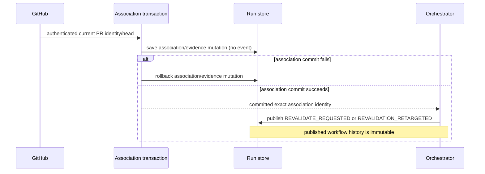
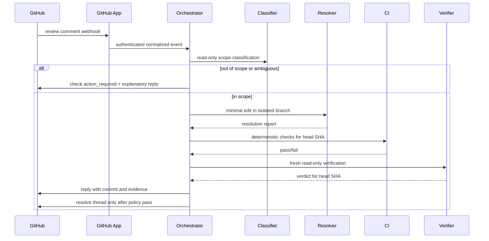

# GitHub App design

This document specifies the GitHub App integration. **Phase A (read-only checks)** is implemented in the single-package tree under `src/github/` (issue #3). The `apps/` / `packages/` layout below remains the **target** for the v0.4 control-plane split and is not required to run the Phase A pilot.

## Phase A status (implemented)

- CLI: `maswe github-webhook`, `maswe github-publish-checks <run-id>`,
  `maswe github-migrate-repository --from <owner/repo> --repository-id <id> [--json]`
- Modules: `src/github/` (signature verify, normalized durable inbox, association index,
  installation token helper, check publisher, adapter, webhook server)
- File-backed state under `.maswe/github/` (hash-addressed delivery state/queue, side-effect
  idempotency keys, associations, and immutable ownership journals)
- Config: optional `githubApp` with `readOnlyChecks: true` required when enabled, and
  `allowedRepositoryIds` as the only operational repository authorization list
- Check names: specification compliance, deterministic quality, independent verification, review comments resolved (always `neutral` in Phase A)
- Non-goals still deferred (Phase B / later): push, PR create/update, comment replies, digest-bound GitHub approvals, Actions artifact ingestion, Postgres control plane

## Objectives

- Turn GitHub issues, pull requests, reviews, comments, pushes, and check results into authenticated workflow events.
- Publish transparent check runs bound to the current head SHA.
- Resolve only in-scope review comments after deterministic CI and fresh verification.
- Use least-privilege installation tokens and idempotent side effects.
- Keep GitHub-specific code outside the orchestration core.

## Proposed components (v0.4+ target layout)

```text
apps/github-app/          # future extraction from src/github/
  webhook HTTP endpoint
  signature verification
  event normalization
  authorization
  delivery deduplication
  check-run publisher
  review reply/thread adapter

apps/control-plane/       # ROADMAP v0.4
  workflow API
  durable queue/workers
  PostgreSQL store
  artifact object store
  runtime adapters

packages/github/          # future shared library extraction
  typed GitHub event contracts
  installation-token client
  idempotent operations
```

Phase A equivalent paths today:

```text
src/github/
  webhook-server.ts
  signature.ts
  normalize.ts
  delivery-inbox.ts / side-effect-store.ts / association.ts
  checks.ts
  token.ts
  adapter.ts
```

## Phase A state and support boundary

Phase A supports exactly one webhook listener/worker plus simultaneous manual-publisher processes
on one host when
`.maswe/github/` is on one coherent local filesystem with atomic no-clobber hard links. It is not a
distributed queue or lock. A second listener, NFS, SMB, distributed FUSE, object-store mounts,
cross-host access, and filesystems without those hard-link semantics are unsupported.

Each logical association, check-create key, and delivery uses a permanent hash-addressed journal:

```text
.maswe/github/journals/
├── association/<sha256-logical-key>/.lock-journal-v3/
├── association-identity/<sha256-repositoryId-and-pr>/.lock-journal-v3/
├── check-create/<sha256-logical-key>/.lock-journal-v3/
├── delivery/<sha256-logical-key>/.lock-journal-v3/
├── publication/<sha256-repositoryId-and-pr>/.lock-journal-v3/
└── repository-identity/<sha256-repositoryId>/.lock-journal-v3/
    ├── format.json
    ├── data/{claims,releases,tmp}/
    ├── admin/{claims,releases,tmp}/
    └── admin-recovery/{claims,releases,tmp}/
```

`repository-identity` is keyed by the stable numeric repository ID and serializes legacy identity
migration, canonical-name reconciliation, repository authorization suspension/recovery, and
repository-scoped publication entry. `publication` and `association-identity` are keyed by
`<repositoryId>#<pullRequestNumber>`. No operational path acquires a name-keyed publication or
association-identity fence.

Claims and releases are canonical, digest-bound immutable files published with hard links. No
published ownership pathname is deleted, replaced, or reused. Before the webhook listener accepts
traffic, initialization probes the association, check-create, publication, and delivery journals,
enumerates and migrates every retained legacy per-check lock by its exact digest, migrates legacy
delivery files, recovers pending leases, and starts the single worker. Published legacy markers
are directory-synced and bind retained stable material before later PID-liveness checks. Manual
publication probes only the journals it uses and never reclaims the listener's delivery leases.
The listener also verifies that all three configured credential environment variables are present
without logging their names or values. Any required credential, probe, or migration failure is
fatal before listener readiness or GitHub API work.

Durable ingress uses a bounded two-level SHA-256 layout rather than scanning a flat delivery
directory during normal operations:

```text
.maswe/github/inbox/
├── state/<digest-prefix>/<delivery-id-digest>/state.json
├── queue/<digest-prefix>/<delivery-id-digest>.queued
└── legacy/<digest-prefix>/<delivery-id-digest>/...
```

The state record contains only the normalized internal event, event name, delivery ID, receive
time, raw-body SHA-256, and lease/retry fields. It never contains the signature, raw request body,
HTTP headers, installation token, app key, webhook secret, or arbitrary exception text. Completed
records are durable tombstones without the normalized event body.

Migration from the earlier association and check-create regular-file/directory locks requires a
quiescent upgrade: stop every old webhook and manual-publisher process, then start only the new
binary. Migration binds the exact legacy bytes or stable empty-directory identity in an immutable
marker and retains the old pathname. A live, malformed, or changing legacy owner fails closed.
Mixed old/new active binaries are unsupported, and operators must not delete retained paths or
journal records.

## Stable repository identity

GitHub's immutable numeric `repository.id` is the sole repository identity anchor. A mutable
`owner/repo` name is routing and display metadata that never authorizes anything.

- `githubApp.allowedRepositoryIds` is the only operational authorization list. Every
  repository-scoped association, reconciliation, credential mint, workflow mutation, and check
  publication requires a non-empty live list containing the exact target ID.
- `githubApp.allowedRepositories` is still accepted, but only to load historical project
  configuration during migration, to select and diagnose unresolved legacy local records, and to
  display operator context. A name in that list grants nothing.
- Look the ID up once with an authenticated request such as
  `gh api repos/<owner>/<repo> --jq .id`, then record it in `allowedRepositoryIds`. The example
  configuration ships with an empty list, which denies everything.
- Repository URLs, redirects, remotes, branch names, PR SHAs, and check resources are never
  substitutes for the ID. MASWE never follows a rename redirect to establish identity: it re-reads
  the canonical name from the authenticated installation-repository listing under the ID it
  already holds.
- Canonical-name lookup traverses at most 100 bounded `per_page=100` pages (10,000 repositories).
  Exhausting that limit is reported as `traversal-limit-exceeded`; it is an ambiguous failure, not
  evidence of absence or of revoked access. Narrow the installation's repository scope rather than
  treating it as a missing repository.

## Repository permissions

Each Phase A installation token is minted for exactly one stable repository ID
(`repository_ids: [<repositoryId>]`) with the exact least-privilege permission set for its purpose.
There is no name-scoped token path anywhere in the credential chain.

| Purpose | Permissions | Used by |
|---|---|---|
| `metadata-reconcile` | Metadata: read | Canonical repository lookup and rename reconciliation |
| `pull-request-read` | Metadata: read; Pull requests: read | PR identity, head/base SHA, and ownership proof |
| `checks` | Metadata: read; Pull requests: read; Checks: write | List, create, update, and alias MASWE check runs |

Webhook subscriptions do not broaden the installation token. Phase A does not request Contents,
Actions, Commit statuses, Issues, or pull-request write permission.

Phase B may add Contents, pull-request, and Issues writes only with a separate feature gate and
permission review. Avoid administration, secrets, environments, deployments, and organization
permissions in the initial release.

## Webhook events

Subscribe to:

- `pull_request`: opened, synchronize, reopened, closed, ready_for_review.
- `pull_request_review`: submitted, edited, dismissed.
- `pull_request_review_comment`: created, edited, deleted.
- `pull_request_review_thread`: resolved, unresolved where available.
- `issue_comment`: created for command/approval comments on PRs and issues.
- `push`: invalidate evidence on branch updates not represented by PR synchronize handling.
- `check_run` and `check_suite`: consume external CI results.
- `workflow_run`: consume GitHub Actions terminal status and artifacts when configured.
- `installation` and `installation_repositories`: maintain tenancy and repository access.

## Authentication and replay protection

1. Read one syntactically safe `X-GitHub-Delivery` and `X-GitHub-Event` value.
2. Verify `X-Hub-Signature-256` against the exact request bytes before decoding.
3. Strictly decode UTF-8, parse a JSON object, and normalize it into the closed internal event.
4. Durably write and sync the normalized envelope and queue marker under the delivery journal.
5. Return the acknowledgement without waiting for GitHub API work; the lease worker acquires an
   installation token only when dispatch starts.
6. Record external request/resource IDs without storing credentials.

## Internal event example

```json
{
  "eventId": "github-delivery-id",
  "type": "review_comment.created",
  "repositoryId": 1308655205,
  "repository": "owner/repo",
  "installationId": 12345,
  "pullRequestNumber": 42,
  "headSha": "abc123",
  "commentId": 98765,
  "threadId": "PRRT_...",
  "author": "reviewer",
  "body": "Please cover the expired token case.",
  "receivedAt": "2026-07-22T12:00:00Z"
}
```

`repositoryId` is the authoritative field; `repository` travels with it for routing and display
only. A new repository-bearing webhook payload without a well-formed `repository.id` is rejected
with HTTP 400 during normalization, before durable enqueue.

The review body is untrusted and never becomes a command.

## Check runs

Publish independent checks:

```text
MASWE / specification compliance
MASWE / deterministic quality
MASWE / independent verification
MASWE / review comments resolved
```

Every check run includes:

- Repository and PR.
- Head SHA.
- Run and attempt IDs.
- Requested and actual model when known.
- Links to approved artifacts.
- Summary of acceptance criteria and blocking findings.
- Conclusion: success, failure, neutral, cancelled, timed_out, or action_required.

Check idempotency keys and the external IDs derived from them are keyed by the stable repository
ID, not by the repository name. A pre-#34 check therefore carries a legacy, name-derived external
ID that the post-#34 key can no longer find. Repository identity migration aliases each existing
attempt-1 production check onto its stable key so the check is adopted rather than duplicated;
until a repository has been migrated, the first post-cutover publication would create a second
copy of every check.

A new head SHA invalidates all previous success conclusions. The app creates or updates checks only for the SHA that was actually evaluated.
The run record retains a bounded set of pending old-head cancellations until every cancellation and
the current-head publication succeeds. A retry therefore cannot forget uncancelled checks after a
partial Checks API failure or a later head change.

A newer authenticated or local head retargets an active or recoverable failed revalidation
generation. Evidence from a superseded generation is unusable. The associated GitHub head is the
required target: quality and verification cannot publish for a worktree head that has not been
aligned to it, and merge-ready/completion require exact workspace/GitHub head equality.
If association publication invalidates evidence while no revalidation is active, the adapter may
request recovery from `BUILDING`, `CI_RUNNING`, `VERIFYING`, or `MERGE_READY` only through the
context-fenced associated-head path. Append-only events determine the return gate: prior entry into
`PR_REVIEW` returns there, otherwise recovery returns to `PR_READY`; stale-head recovery never
restores `MERGE_READY` directly.

Manual and webhook Phase A follow one stable lock order:

```text
repository-identity(repositoryId)
  -> publication / association-identity(repositoryId#pullRequestNumber)
    -> run target mutation fence(runId)
      -> global association transaction / check-create lock
        -> run-store data
```

The single exception is authority-reducing removal of an *unresolved pre-#34 legacy* association
(for example `installation.deleted` against a record that has no `repositoryId`). That branch uses
the common suffix only:

```text
run target mutation fence(runId)
  -> global association transaction
```

It never acquires a name-keyed publication/association-identity fence and never invents a
repository-ID fence for a record that has no ID. Authorization suspension otherwise uses the
applicable suffix (identity, association, store). The run mutation fence is released before checks
are posted; routing itself reacquires it through the shared revalidation service. This prevents a
builder/resolver publication from committing against the prior head between the association update
and the durable request/retarget event. No code path may invert `association transaction -> run
target fence`.

Association state is exact-schema validated and permits one active PR per run ID. PR closure uses
a distinct suspension reason, so a valid `reopened` event can reactivate it. Installation deletion
or repository removal uses authorization suspension, which no PR event may clear.

### Association and workflow publication order

GitHub association publication is event-free and rollback-capable; workflow request and retarget
events publish only after association commit and are never rolled back.



If association commit or rollback reports an outcome-unknown failure, publication stops before a
workflow event. After an association has committed, a request/retarget publication failure is
retried against authoritative state; the committed association is not rolled back across an
already-published event.

An `authorization-revoked` association-index suspension is monotonic. Manual publication checks
it while identity-fenced before any bind or run mutation, and installation/repository suspension
continues through every association before aggregating failures.

## Approval model

Initial options, in increasing assurance:

1. Maintainer runs local `maswe approve` command.
2. Authorized user adds a configured label.
3. Authorized user comments `/maswe approve brainstorm <artifact-digest>`.
4. Web dashboard approval tied to GitHub identity and artifact digest.

Production should authorize users through repository permission or a configured team. The approval record must include actor, timestamp, artifact digest, and source event ID.

## Branch and worktree policy

- Use a dedicated branch `maswe/<run-id>-<slug>`.
- Builder executes in an isolated clone or worktree.
- Deterministic code, not the model, creates commits and pushes.
- Before push, verify the branch base and no disallowed files changed.
- Use optimistic checks to prevent overwriting reviewer or developer commits.
- On PR synchronize, determine whether the change came from MASWE or an external actor and invalidate/replan accordingly.

## Review-comment lifecycle



## Idempotency

Each side effect has a stable key:

```text
check-run: repository/pr/head-sha/check-name/attempt
comment-reply: review-comment-id/resolution-attempt
branch-push: run-id/source-sha/artifact-digest
thread-resolution: thread-id/verified-head-sha
```

For check runs, `external_id` is `maswe:check-run:sha256:<full-digest>` over the complete
repository/PR/head-SHA/check-name/attempt key. This avoids prefix-truncation collisions. Store the
key and resulting GitHub resource ID before acknowledging completion. If the local side-effect
record is missing after an ambiguous create, reconcile with `filter=all`, `per_page=100`, and
bounded pagination across every advertised page; patch a recovered check with the current outcome.

## Failure behavior

- Signature or authorization failure: reject without workflow changes.
- Delivery replay is state-sensitive: a completed tombstone returns HTTP 200 without repeating
  side effects; the same delivery ID/body while queued or processing returns HTTP 202; and the same
  ID with a different event/body digest returns HTTP 409. GitHub does not guarantee automatic
  redelivery after a non-2xx response, so 202 means the normalized event is already durable. A
  storage/sync failure returns 503 and requires operator-observed redelivery if GitHub does not
  retry it.
- Unsupported event/action classifications are completed as intentionally ignored and return HTTP
  200. Invalid UTF-8, JSON, or supported-event fields return 400 without enqueueing.
- Queue claims, heartbeats, retries, and completion are exact-lease mutations under the delivery's
  immutable journal. Dispatch failure emits a sanitized local diagnostic and requeues with bounded
  exponential backoff. Startup runs before listen and converts interrupted processing records to
  queued work; a late lease cannot complete its successor.
- Version-1 completed deliveries migrate to terminal legacy tombstones. Version-1 processing
  records did not retain a normalized payload, so they migrate to `awaiting-redelivery` and cannot
  be invented or dispatched until the exact delivery is redelivered.
- Unhandled server failures are emitted through the local diagnostic callback and return only
  generic HTTP 500 JSON (`internal server error`). Diagnostic callback failure cannot change that
  response or leak environment-variable names/internal exception text. The existing HTTP 413 body
  limit remains.
- The default GitHub fetch client applies a 30-second deadline to each installation-token,
  live-head, Checks API, webhook-triggered, and manual-publication request. Rate-limit retries are
  bounded and every repeated request gets its own finite deadline.
- GitHub rate limit: retry according to reset and backoff headers.
- Stale head SHA: cancel current attempt and restart classification/verification for the new SHA. Live-head lookup failures fail closed (do not apply the event SHA).
- Exact PR identity: association matches only `github.com` remotes over HTTPS or SSH (`git@` / `ssh://git@…/`); plain HTTP and non-GitHub hosts are rejected.
- Concurrent check creates, association mutations, and delivery mutations use immutable ticket
  journals. Only the smallest valid unreleased ticket enters; ESRCH-proven dead lower claims may
  receive exact immutable releases. Live, malformed, ambiguous, or indeterminate owners block.
- Merge conflict: `WAITING_FOR_HUMAN` or a dedicated reconciliation stage.
- CI failure: builder/resolver correction loop under budget.
- Ambiguous review comment: `WAITING_FOR_HUMAN`.
- Permission change or installation removal: suspend every listed repository (including multi-repo `repositories_removed`) and reconcile run records even when the index was already suspended; run-save errors other than missing runs surface to the handler.
- Repository-scoped dispatch is typed as either retryable or **permanent**. A permanent
  disposition performs zero authority-increasing mutation, emits a bounded typed reason, consumes
  the durable delivery instead of retrying it, and never falls back to name-based authorization.
  Permanent reasons include: the ID is not live-allowlisted; stable authorization is not
  configured because the cutover order was violated; the same name resolves a conflicting ID; an
  ordinary historical event carries no stable ID; run/index stable identity conflicts; an
  authenticated live result proves a different identity; and a fully and safely exhausted
  installation-repository listing with the target ID absent when no existing association can be
  authority-reduced (`repository-access-revoked`).
- Rate limits, transient transport or 5xx failures, temporary token/API failures without proven
  authorization loss, pagination page-limit exhaustion, malformed or unsafe pagination responses,
  lock contention, and recoverable durable I/O stay **retryable**. An ambiguous API or pagination
  failure is never proof of revocation.
- If a fully traversed listing proves access was revoked and an affected association is
  successfully suspended as `authorization-revoked`, dispatch returns `applied`: the allowed
  authority-reducing mutation happened and the delivery completes normally. This `applied` case
  does **not** increment `permanentRepositoryDropsSinceStart`: that counter tracks deliveries
  consumed for identity/policy reasons without an authority-reducing mutation, not the successful
  suspension itself.
- Each permanently consumed repository-scoped delivery increments a process-local
  `permanentRepositoryDropsSinceStart` counter. It saturates at `Number.MAX_SAFE_INTEGER`, resets
  on process restart, is never persisted, is never exposed through `doctor`, and its only reader
  is the listener diagnostic callback. It is observability only and never changes dispatch,
  retry, authorization, or migration behavior. A non-zero count means deliveries were dropped for
  identity/policy reasons: investigate the configuration and migration state rather than
  redelivering blindly.

## Capacity, retention, shutdown, and recovery

Completed delivery tombstones, side-effect records, publication/association state, migrated legacy
evidence, and immutable journal claims/releases are retained for the lifetime of an active Phase A
installation. There is no supported automatic pruning: webhook signatures have no replay-expiry
field, and silently deleting a tombstone could re-enable a replayed side effect. Monitor free
bytes, inode consumption, queue depth, oldest queued receive time, retry diagnostics, and journal
growth; provision capacity or stop ingress before the filesystem becomes full.

The worker uses one lease at a time, a 30-second lease with a five-second heartbeat, exponential
retry from 250 ms capped at 30 seconds, and a five-second default drain budget when an embedding
caller asks it to stop. An interrupted active lease remains durable and is recovered at the next
pre-listener startup. `maswe github-publish-checks <run-id>` is a fenced check republisher, not a
delivery-queue repair command; use GitHub's operator-initiated webhook redelivery for a version-1
`awaiting-redelivery` record.

Roll out quiescently: stop every old listener and manual publisher, back up the complete
`.maswe/github/` tree, start one new listener, and verify startup recovery before restoring traffic.
Legacy journal migration requires no-follow file reads (`O_NOFOLLOW`). On Windows, a filesystem or
Node build that cannot provide that guarantee may reject retained legacy owners or migration
markers at startup with `GITHUB_JOURNAL_LEGACY_CHANGED`; migrate on a supported filesystem rather
than weakening the no-follow check.
After the new listener acknowledges traffic, do not roll an old binary onto the migrated tree and
do not restore a pre-traffic backup, because either action can strand acknowledged queue entries.
Stop traffic and roll forward with the complete state tree. Permanent decommission may archive the
whole tree only after disabling the App endpoint and rotating/revoking its webhook secret; partial
active-state deletion is unsupported.

## Rollout plan

1. Read-only GitHub App that posts check summaries but cannot push.
2. Enable branch creation/push for allowlisted repositories.
3. Enable PR comment classification with human-approved resolution.
4. Enable automatic in-scope resolution for low-risk categories.
5. Add thread resolution only after observed reliability targets are met.
6. Add issue-driven intake and approval commands.
